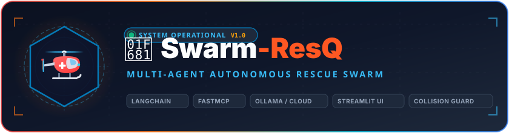
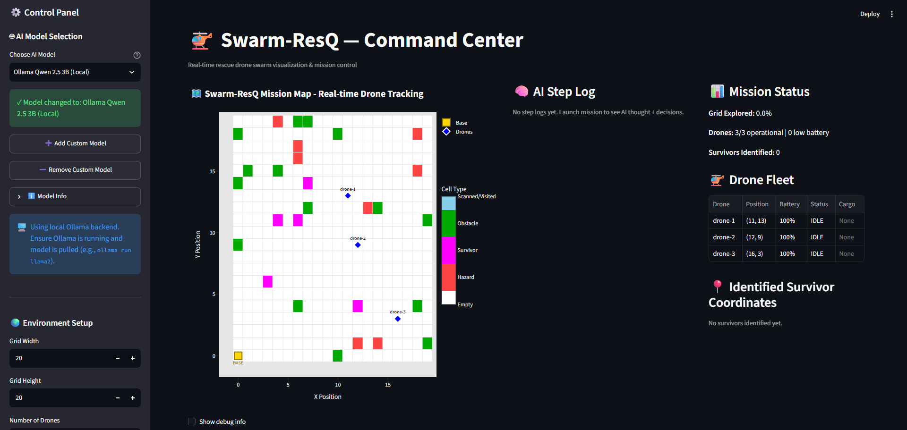

<div align="center">

  

  <br />

  <a href="https://git.io/typing-svg">
    
  </a>

  <p align="center">
    <strong>An enterprise-grade, multi-agent autonomous disaster rescue simulation platform powered by LangChain, FastMCP, and local/cloud LLMs, featuring real-time collision avoidance, dynamic survivor extraction, and interactive tactical mission telemetry.</strong>
  </p>

  <p align="center">
    <a href="./LICENSE"></a>
    <a href="https://www.python.org/"></a>
    <a href="https://python.langchain.com/"></a>
    <a href="https://modelcontextprotocol.io/"></a>
    <a href="https://streamlit.io/"></a>
    <a href="https://ollama.ai/"></a>
    <a href="https://openrouter.ai/"></a>
  </p>

</div>

---

## 📖 Executive Summary

**Swarm-ResQ** is a production-ready, multi-agent autonomous search-and-rescue simulation platform engineered to coordinate drone fleets in high-risk disaster environments. The system models severe emergency scenarios—such as earthquakes, floodings, and industrial collapses—where unknown terrain, hazardous radiation/fire pockets, and physical obstacles prevent direct human intervention.

Powered by a decoupled **Model Context Protocol (MCP)** architecture and **LangChain ReAct** orchestration, Swarm-ResQ automates the full search, triage, and extraction lifecycle: from heuristic grid exploration and obstacle bypass to thermal survivor detection, battery depletion monitoring, and collision-free extraction back to the operational base station.

The architecture is built upon four fundamental design pillars:

* **Autonomous Multi-Agent Coordination**: Collision-free cooperative pathfinding, decentralized grid exploration, and dynamic task delegation across 3–5 aerial rescue drones operating within an active 2D disaster matrix.
* **Model Context Protocol (MCP) Foundation**: Standardized FastMCP tool server providing decoupled, thread-safe hardware actuator abstraction for drone movements, continuous sweeps, thermal scans, and environmental telemetry.
* **Multi-Turn Strategic Reasoning & Memory**: LangChain ReAct loops coupled with persistent memory (`MissionMemory` and `ConversationMemoryBuffer`), maintaining tactical situational awareness, hazard boundaries, and survivor positions across extended operational cycles.
* **Real-Time Visual Telemetry & Mission Control**: High-fidelity Streamlit Command Center featuring live 20×20 grid tracking, streaming Chain-of-Thought logs, dynamic AI model switching (Ollama local vs. OpenRouter cloud), and instantaneous fleet battery telemetry.

---

## 🛠️ Technology Stack

<div align="center">

### Presentation & Command Telemetry (Dashboard Layer)


### Multi-Agent Orchestration & AI Intelligence (Agent Layer)


### Hardware Protocol & Actuator Server (FastMCP Layer)


### Simulation Engine & Physics Environment (Grid Layer)


</div>

---

## 🧩 Core System Modules & Features

Swarm-ResQ is partitioned into 6 decoupled functional subsystems powering end-to-end autonomous rescue operations:

### 1. Autonomous Fleet Navigation & Collision Avoidance
* **Dynamic Separation Planning**: Evaluates inter-drone Euclidean proximity in real time (`get_drone_separation_plan`) to prevent bottlenecking and enforce dispersion across unexplored sectors.
* **Deterministic Collision Guard**: Intercepts intended drone paths to verify cell availability (`get_safe_directions`, `get_collision_status`), preventing drones from occupying identical grid coordinates or colliding with structural debris.
* **Optimized Continuous Sweep**: Accelerates wide-area sector scouting via `move_continuous_until_stopped`, advancing along a heading until an obstacle, hazard, or grid boundary is encountered.

### 2. FastMCP Tool Server & Hardware Abstraction
* **Standardized Tool Suite**: Exposes 20+ specialized drone actuation and introspection tools including `move_drone`, `scan_area`, `rescue_survivor`, `return_to_base`, `get_swarm_state`, and `get_exploration_status`.
* **Thread-Safe Singleton Engine**: Enforces concurrency safety across asynchronous tool invocations using `asyncio.Lock`, preventing race conditions during simultaneous drone commands.
* **Hardware Telemetry Introspection**: Provides granular battery metrics (`estimate_battery_to_target`), survivor tally monitors (`get_survivor_counts`), and discovered obstacle/hazard maps (`get_hazard_map`, `get_obstacle_map`).

### 3. LangChain ReAct Orchestrator & Strategic Memory
* **Multi-Turn ReAct Reasoning**: Commands the swarm via strict Chain-of-Thought cycles (`THOUGHT` ➔ `ACTION` ➔ `OBSERVATION`), ensuring deliberate strategic reasoning prior to physical movement.
* **Sliding Conversation Buffer**: Retains tactical command history across a 20-turn sliding memory window (`ConversationMemoryBuffer`), preventing context window overflow while preserving mission objectives.
* **Persistent Disaster Knowledge Base**: Maintains an incremental `MissionMemory` tracking visited coordinates, confirmed survivor locations, and impassable hazard perimeters across turns.

### 4. Real-Time Command Center & Visual Telemetry
* **Live 20×20 Tactical Grid Display**: Color-coded, high-contrast map rendering base stations (amber), active drones (blue diamonds), visited cells (cyan), hazards (red), obstacles (green), and survivors (magenta).
* **Streaming AI Thought Monitor**: Real-time token-by-token streaming feed displaying model deliberations, tool parameter choices, and status reports directly within the UI.
* **Fleet Vital Statistics**: Live telemetry cards monitoring drone battery percentages, current spatial coordinates, mission states (`IDLE`, `MOVING`, `RESCUING`), and loaded cargo payloads.

### 5. Flexible Multi-Model Inference Engine
* **Local Offline Execution**: Out-of-the-box support for local, privacy-first inference via Ollama (`qwen2.5:3b`, `qwen3.5:4b`) requiring zero API keys or external internet connectivity.
* **Cloud High-Performance Fallback**: Configurable connection to OpenRouter, enabling one-click runtime switching to advanced frontier models (Nvidia Nemotron 120B, Meta Llama 3.1 8B, Qwen 2.5 7B, Microsoft Phi-3).
* **Dynamic Model Management**: On-the-fly addition and removal of custom LLM configurations through the Command Center UI without restarting the application.

### 6. Mission Lifecycle & Post-Incident Telemetry
* **Automated Mission Termination**: Detects deterministic success (100% survivors recovered and returned to base) and critical mission failures (zero operational battery, unreachable survivors).
* **Post-Mission Evaluation**: Computes aggregate performance metrics including duration in seconds, grid coverage percentage, total moves consumed, and extraction efficiency.

---

## 🖥️ System Showcase

Here is a visual walkthrough of the key operational modules within the Swarm-ResQ Command Center:

### 1. Tactical Command Center & Real-Time Mission Map
The primary Command Center interface provides emergency incident commanders with full operational visibility over the disaster grid. Drones continuously report their spatial coordinates, battery consumption, and sensory detections back to base while the central AI orchestrator plans next moves.

<div align="center">
  
</div>

---

### 2. Operational Subsystems in Action

| Panel | Module | Operational Responsibility |
|---|---|---|
| **🗺️ Tactical Mission Map** | `environment/grid.py` | 20×20 interactive matrix tracking base station at `(0,0)`, active drone positions (`drone-1`, `drone-2`, `drone-3`), scanned sectors, survivors, obstacles, and fire hazards. |
| **⚙️ AI Model Selection & Control** | `orchestrator/model_loader.py` | Hot-swappable model selection between local Ollama (`qwen2.5:3b`) and cloud OpenRouter endpoints, with dynamic grid dimension adjustments (`Grid Width`, `Grid Height`, `Number of Drones`). |
| **🧠 Live AI Step Log** | `orchestrator/agent.py` | Asynchronous streaming feed displaying LangChain ReAct thought chains, tool invocations, and status reports token-by-token. |
| **📊 Mission Status & Fleet Vitals** | `environment/drone.py` | Real-time telemetry monitoring percentage of grid explored, operational drones, low battery warnings, survivor discovery counts, and drone cargo status. |

---

## 🏛️ System Architecture

Swarm-ResQ follows a decoupled **Client-Server-Agent Architecture** bridging high-level LLM reasoning with a simulated disaster environment via the Model Context Protocol:

```text
┌─────────────────────────────────────────────────────────────────────────┐
│              Streamlit Web Dashboard (ui/app.py)                         │
├─────────────────────────────────────────────────────────────────────────┤
│  • 20x20 Interactive Plotly Grid Visualization                           │
│  • Token-by-Token Streaming AI Step Log                                  │
│  • Drone Fleet Status, Battery Gauges & Cargo Telemetry                 │
│  • Dynamic AI Model Selector & Environment Configuration                │
└────────────────────────────────────┬────────────────────────────────────┘
                                     │ (Async Streaming / State Poll)
┌────────────────────────────────────▼────────────────────────────────────┐
│              ARIA Agent Orchestrator (orchestrator/agent.py)            │
├─────────────────────────────────────────────────────────────────────────┤
│  • MultiTurnAgent with LangChain ReAct Reasoning Loop                   │
│  • Persistent Memory: ConversationMemoryBuffer + MissionMemory          │
│  • Collision Avoidance & Path Optimization Interceptors                 │
│  • Automated Mission Win/Loss Condition Evaluator                       │
└────────────────────────────────────┬────────────────────────────────────┘
                                     │ (JSON-RPC MCP Tool Invocations)
┌────────────────────────────────────▼────────────────────────────────────┐
│               FastMCP Tool Server (mcp_server/server.py)                │
├─────────────────────────────────────────────────────────────────────────┤
│  • Actuators: move_drone, move_continuous_until_stopped, rescue_survivor│
│  • Sensors: scan_area, estimate_battery_to_target, get_unscanned_zones  │
│  • Telemetry: get_swarm_state, get_drone_state, get_survivor_counts     │
│  • Safety: get_collision_status, get_safe_directions, separation_plan   │
└────────────────────────────────────┬────────────────────────────────────┘
                                     │ (Thread-Safe Engine Lock)
┌────────────────────────────────────▼────────────────────────────────────┐
│            Simulation Environment Engine (environment/)                  │
├─────────────────────────────────────────────────────────────────────────┤
│  • Grid (20x20): EMPTY, OBSTACLE, SURVIVOR, HAZARD, VISITED             │
│  • DroneSwarm: Fleet coordination, battery mechanics, cargo capacity    │
└─────────────────────────────────────────────────────────────────────────┘
```

### Monorepo Directory Organization

```text
swarm-resq/
├── config/
│   └── models.json               # Canonical AI models registry (Ollama & OpenRouter)
├── docs/
│   ├── images/
│   │   └── logo.svg              # Official Swarm-ResQ vector brand logo
│   └── screenshots/
│       └── command_center.png    # High-resolution Command Center interface screenshot
├── environment/
│   ├── __init__.py
│   ├── grid.py                   # 2D disaster matrix, cell classifications, entity placement
│   └── drone.py                  # Drone flight physics, battery depletion, cargo capacity
├── mcp_server/
│   ├── __init__.py
│   └── server.py                 # FastMCP ASGI server exposing 20+ specialized drone tools
├── orchestrator/
│   ├── __init__.py
│   ├── agent.py                  # LangChain ReAct orchestrator & multi-turn memory cycle
│   ├── collision_avoidance.py    # Path validation, separation planning, obstacle avoidance
│   ├── error_handler.py          # Exponential backoff retry logic & tool validation
│   ├── memory.py                 # ConversationMemoryBuffer & spatial MissionMemory
│   ├── mission.py                # Mission completion evaluation & telemetry recorder
│   ├── mission_controller.py     # High-level mission coordination loop
│   ├── model_loader.py           # Dynamic model loading for Ollama and OpenRouter
│   ├── path_tracker.py           # Historical flight path logger & coverage calculator
│   ├── plan_executor.py          # Multi-step strategic drone action execution engine
│   ├── prompts.py                # System prompts, ReAct reasoning templates, task directives
│   └── single_shot_prompts.py    # Fallback zero-shot prompt configurations
├── ui/
│   ├── __init__.py
│   ├── app.py                    # Streamlit dashboard, Plotly heatmaps, streaming interface
│   └── environment_manager.py    # UI-driven environment initialization & state sync
├── .env.example                  # Environment configuration template
├── .gitignore                    # Version control ignore definitions
├── LICENSE                       # MIT Open-Source License
├── mission_log.txt               # Mission outcome execution log
├── requirements.txt              # Production Python package dependencies
├── step_log.txt                  # Real-time agent decision reasoning trace
└── TODO_MASTER.md                # Hackathon project milestone checklist
```

---

## ⚡ Quick Start: Full Setup Guide

Follow this ordered sequence to install, configure, and launch the complete Swarm-ResQ platform on your local workstation.

### 🌐 Quick Access URLs

| Service | Port / URL | Description |
|---|---|---|
| **Command Center Dashboard** | [http://localhost:8501](http://localhost:8501) | Streamlit live mission control & tactical tracking |
| **FastMCP Tool Server** | [http://127.0.0.1:8000](http://127.0.0.1:8000) | FastMCP server exposing drone tools & simulation state |
| **FastMCP Fallback Port** | [http://127.0.0.1:8001](http://127.0.0.1:8001) | Automatic fallback port supported by the dashboard |

---

### Step 1: Software Prerequisites

Ensure the following runtimes and credentials are ready on your machine:

| Component | Minimum Version | Purpose |
|---|---|---|
| **Python** | `3.9+` (Recommended: `3.10` / `3.11`) | Core application runtime |
| **Ollama** *(Optional)* | Latest | Local offline model inference (e.g. `qwen2.5:3b`) |
| **OpenRouter API Key** *(Optional)* | Free Tier | Cloud AI models access ([openrouter.ai](https://openrouter.ai/keys)) |

---

### Step 2: Clone & Initialize Environment

Clone the repository and initialize a dedicated Python virtual environment:

```bash
git clone <repo-url>
cd swarm-resq
python -m venv venv
```

Activate the virtual environment for your platform:

**Windows (PowerShell):**
```powershell
venv\Scripts\Activate.ps1
```

**Windows (Command Prompt):**
```cmd
venv\Scripts\activate.bat
```

**macOS / Linux:**
```bash
source venv/bin/activate
```

---

### Step 3: Install Dependencies

Install all required Python packages via `pip`:

```bash
pip install -r requirements.txt
```

---

### Step 4: Configure Environment Variables

Create your local `.env` configuration file from the provided template:

```bash
cp .env.example .env
```

Open `.env` in your editor and configure the desired parameters:

```env
# MCP Server URL used by UI + orchestrator for tool calls
SERVER_URL=http://127.0.0.1:8000

# Local Ollama endpoint (keep /v1 for OpenAI-compatible routing)
OLLAMA_BASE_URL=http://localhost:11434/v1

# Optional OpenRouter API key (only required when using OpenRouter cloud models)
OPENROUTER_API_KEY=your_openrouter_api_key_here
```

---

### Step 5: Launch Application Services

Swarm-ResQ operates as a coordinated multi-service architecture. Launch the services in separate terminals:

#### Terminal 1 — Start FastMCP Server:
```bash
uvicorn mcp_server.server:app --reload --port 8000
```
> *Expected output: `Uvicorn running on http://127.0.0.1:8000 (Press CTRL+C to quit)`*

#### Terminal 2 — Start Streamlit Command Center:
```bash
streamlit run ui/app.py
```
> *Expected output: `You can now view your Streamlit app in your browser at http://localhost:8501`*

#### Terminal 3 — Optional Standalone CLI Agent:
```bash
python -m orchestrator.agent
```
> *Alternatively, trigger missions directly from the Streamlit UI using the **"🚀 Launch ARIA"** control button.*

---

## 🎛️ Configuration & AI Models

### Supported AI Models

Swarm-ResQ includes dynamic model discovery configured via `config/models.json`:

| Model Name | Provider | Model ID | Key Required | Description |
|---|---|---|:---:|---|
| **Ollama Qwen 2.5 3B (Local)** | Ollama | `qwen2.5:3b` | No | **Default**: Offline local inference via Ollama. |
| **Ollama Qwen 3.5 4B (Local)** | Ollama | `qwen3.5:4b` | No | Fast local reasoning model with thinking suppressed. |
| **Nvidia Nemotron 3 Super 120B** | OpenRouter | `nvidia/nemotron-3-super-120b-a12b:free` | Yes | High-performance frontier reasoning model (Free Tier). |
| **Meta Llama 3.1 8B** | OpenRouter | `meta-llama/llama-3.1-8b-instruct:free` | Yes | Fast, instruction-tuned lightweight model (Free Tier). |
| **Qwen 2.5 7B** | OpenRouter | `qwen/qwen-2.5-7b-instruct:free` | Yes | Alibaba's multilingual reasoning model (Free Tier). |
| **Microsoft Phi-3 Medium** | OpenRouter | `microsoft/phi-3-medium-128k-instruct:free` | Yes | Compact model with extended 128k context (Free Tier). |
| **StepFun 3.5 Flash** | OpenRouter | `stepfun/step-3.5-flash:free` | Yes | Ultra-low latency inference engine (Free Tier). |
| **LiquidAI LFM 2.5 1.2B Thinking** | OpenRouter | `liquid/lfm-2.5-1.2b-thinking:free` | Yes | Lightweight neural reasoning model (Free Tier). |

### Agent Hyperparameters (`orchestrator/agent.py`)

```python
# LLM Model Configuration
model = "qwen2.5:3b"      # Default model ID
temperature = 0            # Deterministic, reproducible decision-making

# Agent Loop Parameters
max_iterations = 30        # Maximum ReAct loops per operational cycle
max_message_pairs = 20     # Sliding memory buffer limit (ConversationMemoryBuffer)

# Operational Timeouts
timeout_seconds = 30.0     # Maximum wait threshold for model response
```

---

## 🛡️ Safety Protocols & Invariants

Swarm-ResQ enforces strict operational invariants to guarantee fleet safety in mission-critical environments:

```
┌─────────────────────────────────────────────────────────────────────────┐
│                      MISSION SAFETY INVARIANTS                          │
├─────────────────────────────────────────────────────────────────────────┤
│  1. BATTERY THRESHOLD GUARD                                             │
│     Battery < 20%  ──► ABORT CURRENT OBJECTIVE ──► IMMEDIATE RETURN     │
│                                                                         │
│  2. COLLISION AVOIDANCE INVARIANT                                       │
│     Target Cell Occupied? ──► RE-EVALUATE HEADING ──► LATERAL DIVERSION │
│                                                                         │
│  3. HAZARD ZONE ISOLATION                                               │
│     Fire / Radiation Detected ──► PERIMETER MARKED ──► RESTRICT ENTRY   │
│                                                                         │
│  4. LLM TIMEOUT CIRCUIT BREAKER                                         │
│     Request Timeout ──► EXPONENTIAL BACKOFF (1s, 2s, 4s) ──► SAFE HOVER │
└─────────────────────────────────────────────────────────────────────────┘
```

1. **Battery Depletion Protection**: If any drone's battery drops below 20%, active exploration orders are immediately suspended, and an uninterruptible `return_to_base` order is dispatched.
2. **Dynamic Spatial Deconfliction**: The collision avoidance module continuously calculates pairwise drone proximity, preventing simultaneous moves into identical grid cells and maintaining safe flight corridors.
3. **Hazard Isolation**: Cells flagged with hazardous conditions (flames, structural collapse, chemical spills) are blacklisted in `MissionMemory`, preventing drones from traversing compromised tiles.
4. **Resilient Network Handling**: Automated exponential backoff retry logic (1s, 2s, 4s) ensures that intermittent LLM API drops do not cause mission crashes.

---

## 📊 Mission Metrics & Telemetry

Following mission completion, Swarm-ResQ compiles full operational telemetry evaluating overall fleet performance:

| Metric | Unit | Description |
|---|---|---|
| **Mission Duration** | Seconds | Total simulated mission duration from deployment to final extraction. |
| **Survivor Extraction Rate** | Percentage (`%`) | Ratio of rescued survivors safely transported to base over total survivors. |
| **Drone Fleet Health** | Count (`x/N`) | Number of drones remaining operational without battery failure. |
| **Disaster Grid Coverage** | Percentage (`%`) | Percentage of grid matrix scanned and charted by the fleet. |
| **Movement Efficiency** | Total Steps | Cumulative sum of all directional steps executed across the fleet. |

### Sample Mission Completion Report

```yaml
MISSION_METRICS:
  status: COMPLETED_SUCCESS
  duration_seconds: 847.3
  survivors_rescued: "5 / 5 (100.0%)"
  drones_operational: "3 / 3 (100.0%)"
  grid_explored: "68.4%"
  total_moves: 142
  survivor_coordinates:
    - id: "survivor-1"
      found_at: [4, 7]
      rescued_by: "drone-1"
    - id: "survivor-2"
      found_at: [12, 15]
      rescued_by: "drone-2"
```

---

## 📄 License

This repository is licensed under the **[MIT License](./LICENSE)**.  
Copyright © 2026 ChamHerman. All rights reserved.
